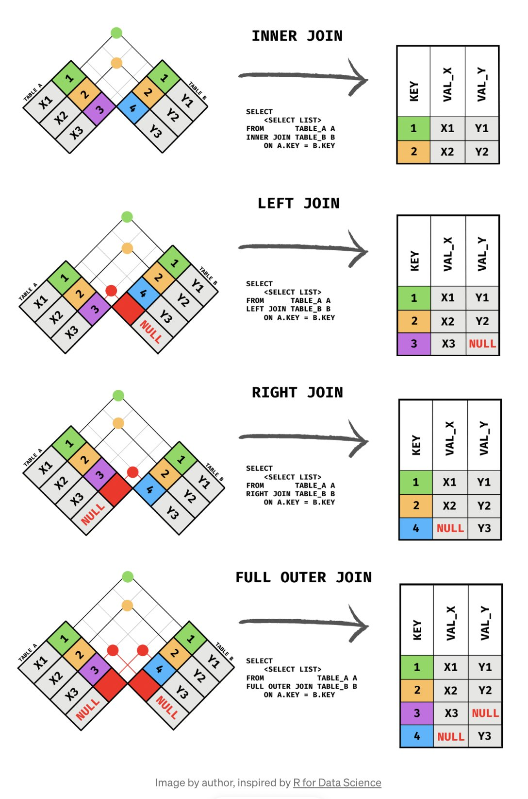

# CS50 SQL 筆記

此份筆記延續[Lecture 0](../lecture-0/README.md)記得先去查看

## Lecture 1: Relating

會使用到兩份資料，分別是 [longlist.db](https://cdn.cs50.net/sql/2023/x/lectures/1/src1/longlist.db) 跟 [sea_lions.db](https://cdn.cs50.net/sql/2023/x/lectures/1/src1/sea_lions.db)，longlist 似乎跟 lecture 0 的不一樣，記得再次下載

### ER（Entity Relationship） Diagrams

在設計 table 的時候，要注意資料之間的關係，這會決定我們要將資料儲存在同一張 table 還是不同張，而關係包含 one-to-one、one-to-many、many-to-many。

用來表示這些關係的圖稱為 ER（Entity Relationship） Diagrams，而我們會用不同的線來表示不同的關係。


以下是一張比較完整的 ER Diagrams，我們來解釋一下 table 之間的關聯

- Author 至少有一本書，所以 Author 連接到 Book 的線，前面會有 one 的線的樣子，而線還具備 many 的特徵是因為 Author 可能有多本書，所以結合 one 跟 many 特徵的線，意味著 “一到多”

- Book 至少會有一名作者，而 Book 可能也會有多個作者，所以關聯也是 “一到多”

- Book 會有 “零到多” 位翻譯，而翻譯只少會翻譯“一到多”本書

- 剩下的關係可以依上述的概念類推


在設計 table 時，將 ER Diagrams 畫出來往往會幫助我們對於資料的理解，並經常可以優化我們的資料庫設計。

但圖上的關係要怎麼被套用到實際的資料庫當中？ 要解決這個問題，我們需要知道 Keys。

### Keys

#### Primary Key

就像是書籍會有 ISBN 這個唯一識別碼，我們也可以為我們的資料添加唯一的識別碼，這稱為「Primary Key」。

#### Foreign Key

而要用這些 key 來讓我們查詢不同表格中資料的關係，我們必須將這個 key 儲存在不同表格中用來讓我們查找，舉例來說：我有 `books` 表格跟 `ratings` 表格，`books` 跟 `ratings` 有一個 one-to-many 的關係，當我今天搜尋到 `books` 的資料，我想要拿 `books`的 key 去搜尋 `books` 在 `ratings` 表格裡面的關聯資料，而 `ratings` 表格會儲存這個 key 來應對我這種查找的需求，而這個被 `ratings` 表格用來應付這種需求的 key 就稱為「foreign key」。


更進階一點，我們可以用不具現實意義的數字或字串來表示唯一識別碼，這也是所謂的 ID


### Many-to-many

前面有說到怎麼處理 one-to-one、one-to-many 的關係，但還沒說到 many-to-many，以下舉一個範例，一個 author 的 id 可以到 authored 去搜尋到多個對應的 book_id，然後我們可以再拿多個 book_id 去搜尋 books


### Subquery

有些場景，你會需要先搜尋一張 table 的資訊，然後再拿該資訊去另一張 table 搜尋，你可能會寫成兩行 SQL 指令

```sql

SELECT id FROM publishers WHERE publisher = 'Fitzcarraldo Editions';

SELECT title FROM books WHERE publisher_id = 5;
```

不過我們其實可以一次就完成上面這個搜尋，這用到 subquery 的技巧

```sql
SELECT title FROM books WHERE publisher_id = (SELECT id FROM publishers WHERE publisher = 'Fitzcarraldo Editions');

```

講簡單一點就是 “巢狀的 query”，一個 query 在另一個 query 裡面。

我們再看一個更複雜的例子，首先是拆開來的版本，這邊先用 ? 來代表上一個搜尋的結果

```sql
SELECT id FROM books WHERE title = 'Flights';

SELECT authod_id FROM authored WHERE book_id = ?;

SELECT name FROM authors WHERE id = ?;
```

使用 subquery 的版本

```sql
SELECT name FROM authors WHERE id = (
  SELECT authod_id FROM authored WHERE book_id = (
    SELECT id FROM books WHERE title = 'Flights'
  )
);
```

我們改變一下場景，前面我們都是搜尋特定一筆，但 subquery 出來的結果有可能是多筆，這時候我們可以使用 `IN`

```sql
SELECT name FROM authors WHERE id IN (
  SELECT authod_id FROM authored WHERE book_id = (
    SELECT id FROM books WHERE title = 'Flights'
  )
);
```

### Join

有時候我們會想要將不同 table 合併來進行報表的生成或進行進階的資料分析，這時候可以使用 JOIN 來達成。接下來我們將使用另一個範例資料庫：[sea_lions.db](https://cdn.cs50.net/sql/2023/x/lectures/1/src1/sea_lions.db)

這個 DB 有兩個 tables，sea_lions 這張 table 儲存 sea lion 的名稱跟 id，migrations 這張則紀錄 sea lion 移動的距離，我們合併來檢視他們

```sql
SELECT * FROM sea_lions JOIN migrations ON migrations.id = sea_lions.id;
```

而 JOIN 有分很多種類，一般 SQL 預設的 JOIN 都是 **INNER JOIN**，其餘還有 **LEFT JOIN** 跟 **RIGHT JOIN**、**FULL OUTER JOIN**，如下圖



除上述之外還有一個有趣的 JOIN 類型稱為 **NATURAL** **JOIN**，這種類型的 JOIN 會自動識別兩 table 中名稱一樣的欄位並進行 JOIN 操作

```sql
SELECT * FROM sea_lions NATURAL JOIN migrations;
```

### Sets

在 SQL 當中有集合的概念

Intersect：你是兩個集合中的交界

Union：你可以同時符合兩個集合的定義

Except：你不屬於其中一個集合


再度回到 longlist.db，使用 `UNION` 寫成 SQL 如下

```sql
SELECT author AS profession, name FROM authors
UNION
SELECT translator AS profession, name FROM translators;
```

使用 `INTERSECT` ，寫成 SQL 如下

```sql
SELECT name FROM authors 
INTERSECT
SELECT name FROM translators;
```

使用 `EXCEPT` ，寫成 SQL 如下

```sql
SELECT name FROM authors 
EXCEPT
SELECT name FROM translators;
```

### Groups

有時候我們需要將資料分組進行操作，因為全部視為一組進行操作得不到我們想要的結果，這時候可以使用 `GROUP BY` 指定想要分組的欄位進行分組然後執行聚合操作來計算結果

```sql
SELECT book_id, AVG(rating) AS "average rating" FROM ratings GROUP BY book_id;
```

如果想要進行條件搜尋，我們不能使用 `WHERE` ，需要改使用 `HAVING`\
⚠️ 注意：不要使用 single quote 會被 sqlite 視為字串，要使用 double quote 才會被正常視為別名

```sql
SELECT book_id, ROUND(AVG(rating), 2) AS "average rating" FROM ratings GROUP BY book_id HAVING "average rating" > 4.0;
```
